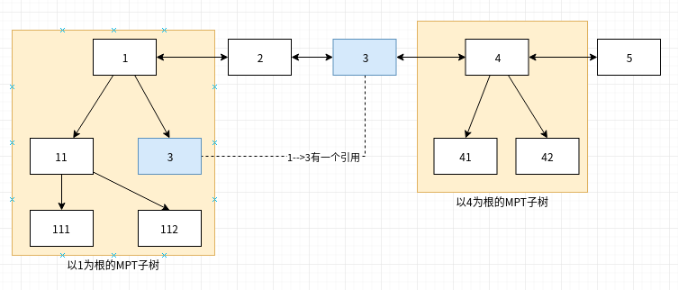

# Trie数据库

## 数据库

trie.Database是Trie数据库在运行时的实例类型。trie.Database会对所有的写操作在内存中进行聚合，并周期性的批量写入KV存储引擎。



```go
type Database struct {
	diskdb ethdb.KeyValueStore // 后端kv存储引擎

	cleans  *bigcache.BigCache          // GC friendly memory cache of clean node RLPs
	dirties map[common.Hash]*cachedNode // 被修改过的节点缓存
	oldest  common.Hash                 // 最早插入的节点key
	newest  common.Hash                 // 最晚插入的节点key

	preimages map[common.Hash][]byte // Preimages of nodes from the secure trie
	seckeybuf [secureKeyLength]byte  // Ephemeral buffer for calculating preimage keys

	gctime  time.Duration      // gc消耗的时间
	gcnodes uint64             // 最近一次gc释放的缓存节点数
	gcsize  common.StorageSize // 最后一次gc释放的内存数
	
	flushtime  time.Duration      // Time spent on data flushing since last commit
	flushnodes uint64             // Nodes flushed since last commit
	flushsize  common.StorageSize // Data storage flushed since last commit

	dirtiesSize   common.StorageSize // Storage size of the dirty node cache (exc. metadata)
	childrenSize  common.StorageSize // Storage size of the external children tracking
	preimagesSize common.StorageSize // Storage size of the preimages cache

	lock sync.RWMutex
}
```



### 方法



```go
//返回后端KV存储引擎
func (db *Database) DiskDB() ethdb.KeyValueReader
//向数据库插入一条二进制数据, 以参数hash作为key
func (db *Database) InsertBlob(hash common.Hash, blob []byte)
//向数据库插入一条记录, hash为key, blob为数据, node是数据对应的MPT树节点
func (db *Database) insert(hash common.Hash, blob []byte, node node)
//返回数据库缓存的MPT树节点
func (db *Database) node(hash common.Hash) node
//从数据库中获取指定key的数据
func (db *Database) Node(hash common.Hash) ([]byte, error)
//枚举所有缓存的key
func (db *Database) Nodes() []common.Hash
//添加一个从parent到child的引用
func (db *Database) Reference(child common.Hash, parent common.Hash)
//解除对一个key的引用
func (db *Database) Dereference(root common.Hash)
//解除从parent到child的引用
func (db *Database) dereference(child common.Hash, parent common.Hash)
//提交内存缓存到kv存储引擎，直到内存缓存占用小于limit
func (db *Database) Cap(limit common.StorageSize) error
//提交指定的key到kv存储引擎
func (db *Database) Commit(node common.Hash, report bool) error
```



## 数据缓存

`trie.Database`用于存储MPT树节点和二进制Blob数据，当前这些数据写入时, trie.Database用一些内置类型对这些数据进行封装



```go
type rawNode []byte //封装纯二进制blob数据
type rawFullNode [17]node //封装MPT分支节点
//封装MPT扩展/叶子结点
type rawShortNode struct {
	Key []byte
	Val node
} 
```



所有写入缓存的节点数据用一个双向链表进行组织管理，链表节点定义为:





```go
type cachedNode struct {
	node node   // Cached collapsed trie node, or raw rlp data 
	size uint16 // Byte size of the useful cached data

	parents  uint32                 // 该节点包含在其它MPT子树的数量
	children map[common.Hash]uint16 // 以该节点作为根的MPT子树的节点集合

	flushPrev common.Hash // 链表前向引用
	flushNext common.Hash // 链表后向引用
}
```



## 写入和获取

### 写入

向Trie数据库插入一个键值对, 参数blob是参数node的rlp序列化数据



```go
func (db *Database) insert(hash common.Hash, blob []byte, node node) {
	// If the node's already cached, skip
	if _, ok := db.dirties[hash]; ok {
		return
	}
	// Create the cached entry for this node
	entry := &cachedNode{
		node:      simplifyNode(node),
		size:      uint16(len(blob)),
		flushPrev: db.newest,
	}
	//entry.childs()获取以entry.node为根的MPT子树节点集合
	for _, child := range entry.childs() {
		if c := db.dirties[child]; c != nil {
			c.parents++
		}
	}
	//将节点加入脏节点集合中
	db.dirties[hash] = entry

	// Update the flush-list endpoints
	if db.oldest == (common.Hash{}) {
		db.oldest, db.newest = hash, hash
	} else {
		db.dirties[db.newest].flushNext, db.newest = hash, hash
	}
	db.dirtiesSize += common.StorageSize(common.HashLength + entry.size)
}
```



### 获取

从Trie数据库中获取指定key的值



```go
func (db *Database) Node(hash common.Hash) ([]byte, error) {
	// It doens't make sense to retrieve the metaroot
	if hash == (common.Hash{}) {
		return nil, errors.New("not found")
	}
	// Retrieve the node from the clean cache if available
	if db.cleans != nil {
		if enc, err := db.cleans.Get(string(hash[:])); err == nil && enc != nil {
			memcacheCleanHitMeter.Mark(1)
			memcacheCleanReadMeter.Mark(int64(len(enc)))
			return enc, nil
		}
	}
	// Retrieve the node from the dirty cache if available
	db.lock.RLock()
	dirty := db.dirties[hash]
	db.lock.RUnlock()

	if dirty != nil {
		return dirty.rlp(), nil
	}
	// Content unavailable in memory, attempt to retrieve from disk
	enc, err := db.diskdb.Get(hash[:])
	if err == nil && enc != nil {
		if db.cleans != nil {
			db.cleans.Set(string(hash[:]), enc)
			memcacheCleanMissMeter.Mark(1)
			memcacheCleanWriteMeter.Mark(int64(len(enc)))
		}
	}
	return enc, err
}

```



## 内存管理

### 引用计数


Trie数据库内存中缓存的节点被组织成双向链表，如果某个节点\(如图中3\)属于另一个节点的子树\(如图中1\)，则这两个节点形成引用关系。

### 新增引用



```go
func (db *Database) Reference(child common.Hash, parent common.Hash) {
	db.lock.Lock()
	defer db.lock.Unlock()

	db.reference(child, parent)
}
func (db *Database) reference(child common.Hash, parent common.Hash) {
	// If the node does not exist, it's a node pulled from disk, skip
	node, ok := db.dirties[child]
	if !ok {
		return
	}
	if db.dirties[parent].children == nil {
		// parent节点还没有被其它节点引用
		db.dirties[parent].children = make(map[common.Hash]uint16)
		db.childrenSize += cachedNodeChildrenSize  // 48字节
	} else if _, ok = db.dirties[parent].children[child]; ok && parent != (common.Hash{}) {
		// parent与child已经存在引用关系
		return
	}
	node.parents++  // child节点引用父节点计数+1
	db.dirties[parent].children[child]++  // parent引用child节点计数+1
	if db.dirties[parent].children[child] == 1 {
		db.childrenSize += common.HashLength + 2 // 子节点计数为uint16,占用2字节
	}
}
```



### 解除引用



```go
func (db *Database) Dereference(root common.Hash) {
	// Sanity check to ensure that the meta-root is not removed
	if root == (common.Hash{}) {
		log.Error("Attempted to dereference the trie cache meta root")
		return
	}
	db.lock.Lock()
	defer db.lock.Unlock()

	nodes, storage, start := len(db.dirties), db.dirtiesSize, time.Now()
	db.dereference(root, common.Hash{})

	db.gcnodes += uint64(nodes - len(db.dirties))
	db.gcsize += storage - db.dirtiesSize
	db.gctime += time.Since(start)
}

// dereference is the private locked version of Dereference.
func (db *Database) dereference(child common.Hash, parent common.Hash) {
	// Dereference the parent-child
	node := db.dirties[parent]

	if node.children != nil && node.children[child] > 0 {
		node.children[child]--
		if node.children[child] == 0 {
			delete(node.children, child)
			db.childrenSize -= (common.HashLength + 2) // uint16 counter
		}
	}
	// If the child does not exist, it's a previously committed node.
	node, ok := db.dirties[child]
	if !ok {
		return
	}
	// If there are no more references to the child, delete it and cascade
	if node.parents > 0 {
		node.parents--
	}
	if node.parents == 0 {
		switch child {
		case db.oldest:
			db.oldest = node.flushNext
			db.dirties[node.flushNext].flushPrev = common.Hash{}
		case db.newest:
			db.newest = node.flushPrev
			db.dirties[node.flushPrev].flushNext = common.Hash{}
		default:
			db.dirties[node.flushPrev].flushNext = node.flushNext
			db.dirties[node.flushNext].flushPrev = node.flushPrev
		}
		// Dereference all children and delete the node
		for _, hash := range node.childs() {
			db.dereference(hash, child)
		}
		delete(db.dirties, child)
		db.dirtiesSize -= common.StorageSize(common.HashLength + int(node.size))
		if node.children != nil {
			db.childrenSize -= cachedNodeChildrenSize
		}
	}
}
```



### 内存占用统计

`trie.Database`会跟踪统计目前缓存占用的内存大小:



```go
type Database struct {
    //....
    dirtiesSize   common.StorageSize // 缓存节点占用的内存空间
	childrenSize  common.StorageSize //引用其它节点缓存节点占用的内存空间
	
	preimagesSize common.StorageSize // Storage size of the preimages cache
	//....
}
```



### 添加节点的内存开销

在插入一个新节点时，会增加`Database.dirtiesSize`的值，用于计算新节点插入带来的内存开销

```go
func (db *Database) insert(hash common.Hash, blob []byte, node node) {
    //....
    //占用内存包含: 节点key占用的内存和节点值占用的内存
    db.dirtiesSize += common.StorageSize(common.HashLength + entry.size)
    //...
}
```

### 添加引用的内存开销

当前一个缓存节点引用另外一个缓存节点时，也会有一些内存开销:

```go
func (db *Database) reference(child common.Hash, parent common.Hash) {
    //.....
    if db.dirties[parent].children == nil {
		db.dirties[parent].children = make(map[common.Hash]uint16)
		//当parent之前没有引用过任何节点，则需要为parent引用信息map数据结构 这部分内存为map结构的大小, 当前为48B
		db.childrenSize += cachedNodeChildrenSize 
	}
    //.....
    //.....
    if db.dirties[parent].children[child] == 1 {
       //当parent之前没有引用过child, 则需要建立引用关系，这会消耗存储key和引用计数(uint16)的内存
		db.childrenSize += common.HashLength + 2 // uint16 counter
	}
}
```

### 解除引用释放内存

解除引用时出现内存释放包含两种情况:

* 父节点对子节点的引用减为0时会释放`childrenSize`内存

```go
func (db *Database) dereference(child common.Hash, parent common.Hash) {
	// Dereference the parent-child
	node := db.dirties[parent]

	if node.children != nil && node.children[child] > 0 {
		node.children[child]--
		if node.children[child] == 0 {
			//父节点对子节点的引用计数减为0, 释放childrenSize内存
			delete(node.children, child)
			db.childrenSize -= (common.HashLength + 2) // uint16 counter
		}
	}
```

* 某个节点被引用的次数减为0，会释放`dirtiesSize`内存

```go
	node, ok := db.dirties[child]
	if !ok {
		return
	}

	if node.parents > 0 {
		node.parents--
	}
	if node.parents == 0 {
		//...
		// Dereference all children and delete the node
		for _, hash := range node.childs() {
			db.dereference(hash, child)
		}
		//节点引用次数减为0，释放节点占用的内存
		delete(db.dirties, child)
		db.dirtiesSize -= common.StorageSize(common.HashLength + int(node.size))
		if node.children != nil {
			db.childrenSize -= cachedNodeChildrenSize
		}
	}
```

