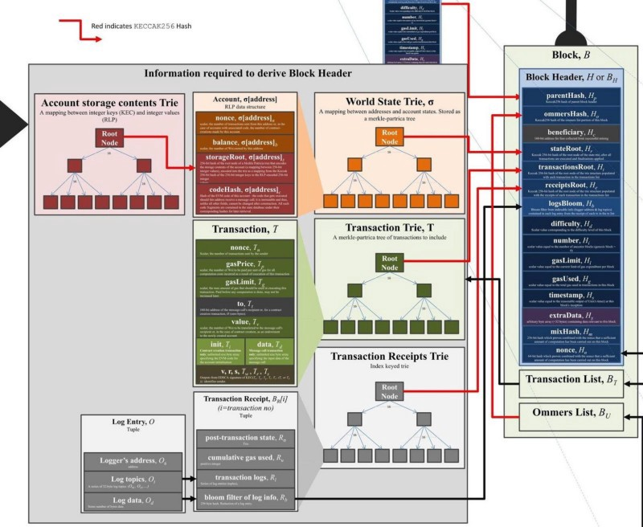

# 状态数据库



## 世界状态

世界状态\(World State\)是所有帐户\(Account\)状态组成的集合，通过一个MPT树进行组织，树根\(root\)存储在块结构中的stateRoot域中。



```go
		//获取世界状态数据库
		parent := it.previous()
		if parent == nil {
			parent = bc.GetHeader(block.ParentHash(), block.NumberU64()-1)
		}
		statedb, err := state.New(parent.Root, bc.stateCache) //参见core/state/statedb.go
		if err != nil {
			return it.index, events, coalescedLogs, err
		}
```



```go
func New(root common.Hash, db Database) (*StateDB, error) {
	tr, err := db.OpenTrie(root)  ////根据stateRoot创建MPT树
	if err != nil {
		return nil, err
	}
	return &StateDB{
		db:                db,
		trie:              tr,
		stateObjects:      make(map[common.Address]*stateObject),
		stateObjectsDirty: make(map[common.Address]struct{}),
		logs:              make(map[common.Hash][]*types.Log),
		preimages:         make(map[common.Hash][]byte),
		journal:           newJournal(),
	}, nil
}
```



### 状态数据库

状态数据库是以帐户地址作为键的KV数据库。



```go
type StateDB struct {
	db   Database  //存储mpt树, 合约代码
	trie Trie //世界状态对应的mpt树

	stateObjects      map[common.Address]*stateObject
	stateObjectsDirty map[common.Address]struct{}

	dbErr error  //数据库发生的错误

	refund uint64

	thash, bhash common.Hash //当前evm正在处理的Block, Transaction哈希值
	txIndex      int   //当前正在处理的事务索引
	logs         map[common.Hash][]*types.Log //合约日志记录
	logSize      uint //合约日志条数

	preimages map[common.Hash][]byte

	//以下字段用于snapshot
	journal        *journal
	validRevisions []revision
	nextRevisionId int
	.....
}
```



```go
type stateObject struct {
	address  common.Address  //帐户地址
	addrHash common.Hash // 帐户地址对应的hash
	data     Account //帐户地址对应的帐户状态值
	db       *StateDB //与这个stateObject关联的statedb

	dbErr error //数据库错误

	trie Trie // 帐户管理的局部状态MPT数
	code Code // 合约帐户的代码

	originStorage Storage // Storage cache of original entries to dedup rewrites
	dirtyStorage  Storage // Storage entries that need to be flushed to disk
	fakeStorage   Storage // Fake storage which constructed by caller for debugging purpose.

	// Cache flags.
	// When an object is marked suicided it will be delete from the trie
	// during the "update" phase of the state transition.
	dirtyCode bool // true if the code was updated
	suicided  bool
	deleted   bool
}
```



### 帐户数据

StateDB中帐户详细数据用stateObject结构表示:



```go
type stateObject struct {
	address  common.Address //帐户地址
	addrHash common.Hash // 帐户地址哈希
	data     Account //帐户状态
	db       *StateDB //该stateObject关联的StateDB
	
	dbErr error  //数据库错误

	// Write caches.
	trie Trie // 帐户的合约状态数据trie数据库
	code Code // 帐户的合约代码

	originStorage Storage // 内存临时存储，缓存从trie中已经读取的数据
	dirtyStorage  Storage //内存临时存储，存放暂未提交的帐户kv
	fakeStorage   Storage //内存临时存储，方便调试

    //数据状态标记
	dirtyCode bool // 合约代码是否被修改
	suicided  bool  //帐户被销毁标记
	deleted   bool //是否已经删除
}
```



#### Trie树

以太坊中帐户可以包含一些持久化数据，这些数据以键值对的形式存储是一个Trie树中, Account.Root存放着这棵树的根, 在内存中通过stateObject.trie可以访问这棵树.



```go
func (s *stateObject) getTrie(db Database) Trie {
	if s.trie == nil {
		var err error
		s.trie, err = db.OpenStorageTrie(s.addrHash, s.data.Root)  //s.addrHash暂时不用，只直接通过s.data.Root打开trie树
		if err != nil {
			s.trie, _ = db.OpenStorageTrie(s.addrHash, common.Hash{})
			s.setError(fmt.Errorf("can't create storage trie: %v", err))
		}
	}
	return s.trie
}
```



#### 方法



```go
//stateObject进行RLP编码，只编码stateObject.data字段.
func (s *stateObject) EncodeRLP(w io.Writer) error
//返回帐户地址
func (s *stateObject) Address() common.Address
//设置帐户交易计数器
func (s *stateObject) SetNonce(nonce uint64)
//返回帐户交易计数
func (s *stateObject) Nonce() uint64 

//获取帐户数据中指定key的值，该值可能是还未提交的值，也是已经提交到storage trie的值
func (s *stateObject) GetState(db Database, key common.Hash) common.Hash 
//设置新的帐户数据
func (s *stateObject) SetState(db Database, key, value common.Hash)
//从帐户storage trie中获取已经提交的值.
func (s *stateObject) GetCommittedState(db Database, key common.Hash) common.Hash
//提交storage trie树
func (s *stateObject) CommitTrie(db Database) error

//返回帐户余额
func (s *stateObject) Balance() *big.Int
//增加帐户余额
func (s *stateObject) AddBalance(amount *big.Int) 
//减少帐户余额
func (s *stateObject) SubBalance(amount *big.Int)
//修改帐户余额
func (s *stateObject) SetBalance(amount *big.Int)

//返回合约代码
func (s *stateObject) Code(db Database) []byte
//设置合约代码
func (s *stateObject) SetCode(codeHash common.Hash, code []byte)
//返回合约哈希值
func (s *stateObject) CodeHash() []byte
```



### 方法



```go
//获取数据库操作最后一次错误
func (self *StateDB) Error() error
//重置StateDB对象
func (self *StateDB) Reset(root common.Hash) error
//添加一条合约日志
func (self *StateDB) AddLog(log *types.Log)
//根据交易hash获取合约日志序列
func (self *StateDB) GetLogs(hash common.Hash) []*types.Log
//获取所有的合约日志
func (self *StateDB) Logs() []*types.Log

func (self *StateDB) AddPreimage(hash common.Hash, preimage []byte)
func (self *StateDB) Preimages() map[common.Hash][]byte

func (self *StateDB) AddRefund(gas uint64)
func (self *StateDB) SubRefund(gas uint64)
func (self *StateDB) GetRefund() uint64 

func (self *StateDB) Exist(addr common.Address) bool
func (self *StateDB) Empty(addr common.Address)

func (self *StateDB) GetBalance(addr common.Address) *big.Int
func (self *StateDB) GetNonce(addr common.Address) uint64
//增加帐户余额
func (self *StateDB) AddBalance(addr common.Address, amount *big.Int)
//减少帐户余额
func (self *StateDB) SubBalance(addr common.Address, amount *big.Int)
//设置帐户余额
func (self *StateDB) SetBalance(addr common.Address, amount *big.Int)
//设置帐户交易计数
func (self *StateDB) SetNonce(addr common.Address, nonce uint64)

func (self *StateDB) TxIndex() int
func (self *StateDB) BlockHash() common.Hash

//设置帐户合约代码
func (self *StateDB) SetCode(addr common.Address, code []byte)
func (self *StateDB) GetCode(addr common.Address) []byte
func (self *StateDB) GetCodeSize(addr common.Address) int
func (self *StateDB) GetCodeHash(addr common.Address) common.Hash

func (self *StateDB) GetProof(a common.Address) ([][]byte, error)
func (self *StateDB) GetStorageProof(a common.Address, key common.Hash) ([][]byte, error)

//获取帐户数据中某个key的值，有可能该值还未提交
func (self *StateDB) GetState(addr common.Address, hash common.Hash) common.Hash
//获取帐户数据中某个key已经提交的值
func (self *StateDB) GetCommittedState(addr common.Address, hash common.Hash) common.Hash
//设置帐户数据新的状态
func (self *StateDB) SetState(addr common.Address, key, value common.Hash)

//返回StateDB的后端存储
func (self *StateDB) Database() Database
//返回帐户数据的Trie树，并提交内存状态修改到Trie树
func (self *StateDB) StorageTrie(addr common.Address) Trie

//帐户是否被主动销毁
func (self *StateDB) HasSuicided(addr common.Address) bool

//销毁帐户
func (self *StateDB) Suicide(addr common.Address)

//获取或新建帐户stateObject
func (self *StateDB) GetOrNewStateObject(addr common.Address) *stateObject
//新建帐户
func (self *StateDB) CreateAccount(addr common.Address)
//遍历帐户数据所有的状态
func (db *StateDB) ForEachStorage(addr common.Address, cb func(key, value common.Hash) bool) error
//深拷贝StateDB
func (self *StateDB) Copy() *StateDB 

//StateDB快照
func (self *StateDB) Snapshot() int
//回滚到指定的快照
func (self *StateDB) RevertToSnapshot(revid int)

func (self *StateDB) Prepare(thash, bhash common.Hash, ti int)
func (s *StateDB) IntermediateRoot(deleteEmptyObjects bool) common.Hash
func (s *StateDB) Commit(deleteEmptyObjects bool) (root common.Hash, err error)
func (s *StateDB) Finalise(deleteEmptyObjects bool)

```



