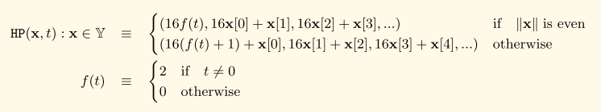

# HP编码

## 定义

HP编码的数学定义:



其中:

* Y是半字节序列集合
* t是一个附加标记

HP编码后的字节数组中第一个字节hp\[0\]=\(high\_nibble, low\_nibble\)具有以下结构:

* high\_nibble的右起第一位记录了编码前半字节数组的奇偶性
* high\_nibble的右起第二位记录了HP编码的附加标记是否被设置
* low\_nibble的所有位均置0

## 源码解析

HP编码相关代码位于文件:

```text
ethereum/go-ethereum/trie/encoding.go
```

### 编码

将字节数据转换为nibble数组

```go
func keybytesToHex(str []byte) []byte {
	l := len(str)*2 + 1
	var nibbles = make([]byte, l)
	for i, b := range str {
		nibbles[i*2] = b / 16
		nibbles[i*2+1] = b % 16
	}
	nibbles[l-1] = 16 #设置flag
	return nibbles
}
```

对nibble数组进行压缩

```go
func hexToCompact(hex []byte) []byte {
	terminator := byte(0)
	if hasTerm(hex) {   //判断是否设置flag
		terminator = 1
		hex = hex[:len(hex)-1]
	}
	buf := make([]byte, len(hex)/2+1)
	buf[0] = terminator << 5 // the flag byte
	if len(hex)&1 == 1 {
		buf[0] |= 1 << 4 // odd flag
		buf[0] |= hex[0] // first nibble is contained in the first byte
		hex = hex[1:]
	}
	decodeNibbles(hex, buf[1:])
	return buf
}
```

```go
//压缩算法: 将两个nibble合并为一个byte
func decodeNibbles(nibbles []byte, bytes []byte) {
	for bi, ni := 0, 0; ni < len(nibbles); bi, ni = bi+1, ni+2 {
		bytes[bi] = nibbles[ni]<<4 | nibbles[ni+1]
	}
}
```

### 解码

解压nibble数组

```go
func compactToHex(compact []byte) []byte {
	if len(compact) == 0 {
		return compact
	}
	base := keybytesToHex(compact)
	// delete terminator flag
	if base[0] < 2 {
		base = base[:len(base)-1]
	}
	// apply odd flag
	chop := 2 - base[0]&1 //对于奇数情况，第二个nibble(base[1])是真实数据的一部分
	return base[chop:]
}
```

将nibble数组转换为字节数据

```go
func hexToKeybytes(hex []byte) []byte {
	if hasTerm(hex) {
		hex = hex[:len(hex)-1]
	}
	if len(hex)&1 != 0 {
		panic("can't convert hex key of odd length")
	}
	key := make([]byte, len(hex)/2)
	decodeNibbles(hex, key)
	return key
}
```

