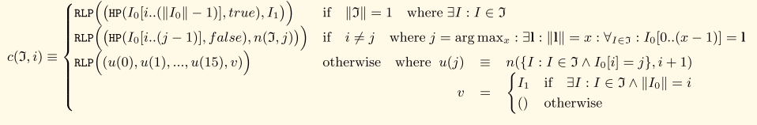
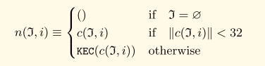

# MPT树

## 定义


### 结点类型

#### 叶子结点\(Leaf\)

一种终结结点，代表唯一确定一个\(key, value\)键值对:

* 拥有一个nibble数组，采用HP编码，并且终结标志置1。遍历到该结点所经历的nibble序列加上该结点的nibble数组唯一的构成key.
* 结点拥有的值为key对应的值

#### 扩展结点\(Extension\)

一种非终结结点。代表两个不同的key的共享的一段nibble数组:

* 拥有一个nibble数组, 采用HP编码，并且终结标志置0。nibble数组为至少两个不同的key的共享部分。
* 结点拥有一个值，该值为一个hash，指向其它分支结点。

#### 分支结点\(Branch\)

分支结点是一个Trie树的结点:

* 结点的度为17，其中16个用于索引\(nibble的取值空间\)其它结点，第17个用于存放分支结点的值\(此时结点是一个终结结点\)
* 如果结点有值，则该分支结点也是一个终结结点。

### 数学定义






* 当结点的RLP编码后的数据长度不超过32B, 则直接存储结点本身
* 当结点的RLP编码后的数据长度超过32B，则引用该结点的哈希值

## 结点类型

```go
type node interface {
	fstring(string) string
	cache() (hashNode, bool)
}

type nodeFlag struct {
	hash  hashNode // 结点的hash缓存
	dirty bool     //脏结点标志
}

type (
    //分支结点
	fullNode struct {
		Children [17]node // Actual trie node data to encode/decode (needs custom encoder)
		flags    nodeFlag
	}
	//扩展/叶子结点
	shortNode struct {
		Key   []byte
		Val   node
		flags nodeFlag
	}
	
	hashNode  []byte  //代表一个哈希
	valueNode []byte  //代表一个值
)
```

## 结点解析

* 解析分支结点

```go
//分支结点
func decodeFull(hash, elems []byte) (*fullNode, error) {
	n := &fullNode{flags: nodeFlag{hash: hash}}
	//分支结点包含16个分支
	for i := 0; i < 16; i++ {
		cld, rest, err := decodeRef(elems)  //解析分支引用
		if err != nil {
			return n, wrapError(err, fmt.Sprintf("[%d]", i))
		}
		n.Children[i], elems = cld, rest
	}
	//解析分支结点的值
	val, _, err := rlp.SplitString(elems)
	if err != nil {
		return n, err
	}
	if len(val) > 0 {
		n.Children[16] = append(valueNode{}, val...)
	}
	return n, nil
}
```

* 解析扩展/叶子结点

```go
func decodeShort(hash, elems []byte) (node, error) {
	kbuf, rest, err := rlp.SplitString(elems)
	if err != nil {
		return nil, err
	}
	flag := nodeFlag{hash: hash}
	key := compactToHex(kbuf)
	if hasTerm(key) {
		//设置终结标识被设置，所以是一个叶子结点
		val, _, err := rlp.SplitString(rest)
		if err != nil {
			return nil, fmt.Errorf("invalid value node: %v", err)
		}
		return &shortNode{key, append(valueNode{}, val...), flag}, nil
	}
	r, _, err := decodeRef(rest)
	if err != nil {
		return nil, wrapError(err, "val")
	}
	return &shortNode{key, r, flag}, nil
}
```

* 子结点引用

分支结点、扩展结点和叶子结点都会引用其它值结点或哈希结点，Ethereum采用一个decodeRef方法处理

```go
func decodeRef(buf []byte) (node, []byte, error) {
	kind, val, rest, err := rlp.Split(buf)
	if err != nil {
		return nil, buf, err
	}
	switch {
	case kind == rlp.List:
		//当前子结点RLP编码后的数据长度小于32字节则直接嵌套在父结点中
		if size := len(buf) - len(rest); size > hashLen {
			err := fmt.Errorf("oversized embedded node (size is %d bytes, want size < %d)", size, hashLen)
			return nil, buf, err
		}
		n, err := decodeNode(nil, buf)
		return n, rest, err
	case kind == rlp.String && len(val) == 0:
		// empty node
		return nil, rest, nil
	case kind == rlp.String && len(val) == 32:
		return append(hashNode{}, val...), rest, nil
	default:
		return nil, nil, fmt.Errorf("invalid RLP string size %d (want 0 or 32)", len(val))
	}
}
```

## Trier树

### 定义

```go
type Trie struct {
	db   *Database  //Trie数据存储
	root node  //根结点索引, root可以为空，空root意味是空树
}
//公开方法
func (t *Trie) Get(key []byte) []byte
func (t *Trie) TryGet(key []byte) ([]byte, error)
func (t *Trie) Update(key, value []byte)
func (t *Trie) TryUpdate(key, value []byte) error
func (t *Trie) Delete(key []byte)
func (t *Trie) TryDelete(key []byte) error
func (t *Trie) Hash() common.Hash
func (t *Trie) Commit(onleaf LeafCallback) (root common.Hash, err error)
func (t *Trie) Prove(key []byte, fromLevel uint, proofDb ethdb.KeyValueWriter) error
```

### 插入

```go
func (t *Trie) insert(n node, prefix, key []byte, value node) (bool, node, error) {
	if len(key) == 0 {
		if v, ok := n.(valueNode); ok {
			return !bytes.Equal(v, value.(valueNode)), value, nil
		}
		return true, value, nil
	}
	//根据结点类型分处理
	switch n := n.(type) {
	...... 
```

* 如果是空树

```go
case nil:
		return true, &shortNode{key, value, t.newFlag()}, nil
```

* 如果是分支结点

```go
case *fullNode:
		dirty, nn, err := t.insert(n.Children[key[0]], append(prefix, key[0]), key[1:], value)
		if !dirty || err != nil {
			return false, n, err
		}
		n = n.copy()
		n.flags = t.newFlag()
		n.Children[key[0]] = nn
		return true, n, nil
```

* 如是哈希结点\(结点引用\)

```go
case hashNode:
		// We've hit a part of the trie that isn't loaded yet. Load
		// the node and insert into it. This leaves all child nodes on
		// the path to the value in the trie.
		rn, err := t.resolveHash(n, prefix)   //从数据库中加载该结点到内存中
		if err != nil {
			return false, nil, err
		}
		dirty, nn, err := t.insert(rn, prefix, key, value)
		if !dirty || err != nil {
			return false, rn, err
		}
		return true, nn, nil
```

* 如果是叶子结点或扩展结点

```go
case *shortNode:
		matchlen := prefixLen(key, n.Key)
		// If the whole key matches, keep this short node as is
		// and only update the value.
		if matchlen == len(n.Key) {
			dirty, nn, err := t.insert(n.Val, append(prefix, key[:matchlen]...), key[matchlen:], value)
			if !dirty || err != nil {
				return false, n, err
			}
			return true, &shortNode{n.Key, nn, t.newFlag()}, nil
		}
		// Otherwise branch out at the index where they differ.
		branch := &fullNode{flags: t.newFlag()}
		var err error
		_, branch.Children[n.Key[matchlen]], err = t.insert(nil, append(prefix, n.Key[:matchlen+1]...), n.Key[matchlen+1:], n.Val)
		if err != nil {
			return false, nil, err
		}
		_, branch.Children[key[matchlen]], err = t.insert(nil, append(prefix, key[:matchlen+1]...), key[matchlen+1:], value)
		if err != nil {
			return false, nil, err
		}
		// Replace this shortNode with the branch if it occurs at index 0.
		if matchlen == 0 {
			return true, branch, nil
		}
		// Otherwise, replace it with a short node leading up to the branch.
		return true, &shortNode{key[:matchlen], branch, t.newFlag()}, nil
```

### 查找

### 删除

### 哈希

```go
func (t *Trie) Hash() common.Hash {
	hash, cached, _ := t.hashRoot(nil, nil)
	t.root = cached
	return common.BytesToHash(hash.(hashNode))
}
func (t *Trie) hashRoot(db *Database, onleaf LeafCallback) (node, node, error) {
	if t.root == nil {
		return hashNode(emptyRoot.Bytes()), nil, nil
	}
	h := newHasher(onleaf)
	defer returnHasherToPool(h)
	return h.hash(t.root, db, true)
}
```

Ethereum使用自定义hasher对象完成对Trie树的hash计算


```go
//hasher
type hasher struct {
	tmp    sliceBuffer
	sha    keccakState
	onleaf LeafCallback
}
//遍历到叶子结点时的回调函数
type LeafCallback func(leaf []byte, parent common.Hash) error

type keccakState interface {
	hash.Hash
	Read([]byte) (int, error)
}

type sliceBuffer []byte
```


hasher对象采用对象池技术进行管理


```go
var hasherPool = sync.Pool{
	New: func() interface{} {
		return &hasher{
			tmp: make(sliceBuffer, 0, 550), // cap is as large as a full fullNode.
			sha: sha3.NewLegacyKeccak256().(keccakState),
		}
	},
}

func newHasher(onleaf LeafCallback) *hasher {
	h := hasherPool.Get().(*hasher)
	h.onleaf = onleaf
	return h
}

func returnHasherToPool(h *hasher) {
	hasherPool.Put(h)
}
```


hasher对象先检查Trie树的hash缓存，如果缓存存在并且树没有被修改过，则优先使用缓存


```go
func (h *hasher) hash(n node, db *Database, force bool) (node, node, error) {
	// If we're not storing the node, just hashing, use available cached data
	if hash, dirty := n.cache(); hash != nil {
		if db == nil {
			return hash, n, nil
		}
		if !dirty {
			switch n.(type) {
			case *fullNode, *shortNode:
				return hash, hash, nil
			default:
				return hash, n, nil
			}
		}
	}
    //....
```


在没有缓存或树被修改过的情况时，则需要对树进行完整hash. hasher优先对子树进行哈希

```go
// Trie not processed yet or needs storage, walk the children
	collapsed, cached, err := h.hashChildren(n, db)
	if err != nil {
		return hashNode{}, n, err
	}

//哈希子树
func (h *hasher) hashChildren(original node, db *Database) (node, node, error) {
	var err error

	switch n := original.(type) {
	case *shortNode:
		// Hash the short node's child, caching the newly hashed subtree
		collapsed, cached := n.copy(), n.copy()  //浅拷贝结点
		collapsed.Key = hexToCompact(n.Key)  //对结点的key进行压缩
		cached.Key = common.CopyBytes(n.Key)  

		if _, ok := n.Val.(valueNode); !ok {
		    //当前结点不是叶子结点，即是一个扩展结点，继续哈希该结点
			collapsed.Val, cached.Val, err = h.hash(n.Val, db, false)
			if err != nil {
				return original, original, err
			}
		}
		return collapsed, cached, nil

	case *fullNode:
		// Hash the full node's children, caching the newly hashed subtrees
		collapsed, cached := n.copy(), n.copy()
        
        //对分支结点的各个分支进行压缩
		for i := 0; i < 16; i++ {
			if n.Children[i] != nil {
				collapsed.Children[i], cached.Children[i], err = h.hash(n.Children[i], db, false)
				if err != nil {
					return original, original, err
				}
			}
		}
		cached.Children[16] = n.Children[16]
		return collapsed, cached, nil

	default:
		// Value and hash nodes don't have children so they're left as were
		return n, original, nil
	}
}
```

计算子树哈希后，生成树的哈希，并存储到内存Database中.

```go
hashed, err := h.store(collapsed, db, force)
	if err != nil {
		return hashNode{}, n, err
	}
	
//生成哈希并存储
func (h *hasher) store(n node, db *Database, force bool) (node, error) {
	// Don't store hashes or empty nodes.
	if _, isHash := n.(hashNode); n == nil || isHash {
		return n, nil
	}
	// Generate the RLP encoding of the node
	h.tmp.Reset()
	if err := rlp.Encode(&h.tmp, n); err != nil {
		panic("encode error: " + err.Error())
	}
	if len(h.tmp) < 32 && !force {
	    //非强制模式下，不进行哈希，原文返回
		return n, nil // Nodes smaller than 32 bytes are stored inside their parent
	}
	// Larger nodes are replaced by their hash and stored in the database.
	hash, _ := n.cache()
	if hash == nil {
		hash = h.makeHashNode(h.tmp)  //生成哈希
	}

	if db != nil {
		// We are pooling the trie nodes into an intermediate memory cache
		hash := common.BytesToHash(hash)

		db.lock.Lock()
		db.insert(hash, h.tmp, n)  //将结点存储到Database中
		db.lock.Unlock()

		// Track external references from account->storage trie
		//通知叶结点回调函数
		if h.onleaf != nil {
			switch n := n.(type) {
			case *shortNode:
				if child, ok := n.Val.(valueNode); ok {
					h.onleaf(child, hash)
				}
			case *fullNode:
				for i := 0; i < 16; i++ {
					if child, ok := n.Children[i].(valueNode); ok {
						h.onleaf(child, hash)
					}
				}
			}
		}
	}
	return hash, nil
}
```

最后更新结点哈希缓存

```go
cachedHash, _ := hashed.(hashNode)
	switch cn := cached.(type) {
	case *shortNode:
		cn.flags.hash = cachedHash
		if db != nil {
			cn.flags.dirty = false
		}
	case *fullNode:
		cn.flags.hash = cachedHash
		if db != nil {
			cn.flags.dirty = false
		}
	}
```

```go
case nil:
		return true, &shortNode{key, value, t.newFlag()}, nil
```

### 证明

## 安全Trie树

### 定义

```go
type SecureTrie struct {
	trie             Trie
	hashKeyBuf       [common.HashLength]byte
	secKeyCache      map[string][]byte
	secKeyCacheOwner *SecureTrie // Pointer to self, replace the key cache on mismatch
}
```

## 参考资料

* [https://github.com/ethereum/wiki/wiki/Patricia-Tree\#tries-in-ethereum](https://github.com/ethereum/wiki/wiki/Patricia-Tree#tries-in-ethereum)
* [http://www.cnspirit.com/2018/04/go-ethereum-4.html](http://www.cnspirit.com/2018/04/go-ethereum-4.html)
* [https://ethfans.org/toya/articles/588](https://ethfans.org/toya/articles/588)
* 以太坊黄皮书

