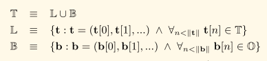
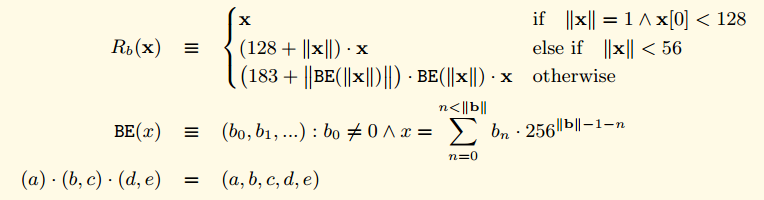
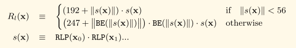

# RLP编码

## 数学定义

以太坊中的数据序列化方法，用来编码任意结构化的二进制数据

T代表结构化二进制数据集合



* O代表8位比特序列集合
* B代表任意长度的字节数组
* L代表一个树状结构二进制数据，且L不仅仅只有一个叶子节点
* T代表所有树状结构和字节数据的集合

RLP使用两个函数分别处理字节数组和树状结构


### 字节数组

字节数组处理规则如下:

* \|\|B\|\|=1，并且字节的值小于128, 则不做任何处理，原字节输出
* \|\|B\|\|&lt;56, 则在原始数据前面加上（128+字节数据的长度\)的前缀
* \|\|B\|\|&gt;=56, 则在原始数据前面加上原始数据长度的大端表示, 然后在前面加上（183 + 原始数据大端表示的长度\)

数学表示如下



### 树状结构

对于树状结构数据，采用以下方式处理:

1. 树形结构里面的每个元素使用RLP处理, 然后将每个元素的RLP编码值串接在一起
2. 对串接后的字节数组LB:
   * \|\|LB\|\|&lt;56, 则在前面加上\(192 + 连接后的长度\)，组成最终的结果
   * \|\|LB\|\|&gt;=56, 则在前面先加上连接后的长度的大端模式，然后在前面加上\(247 + 连接后长度的大端模式的长度\)

数学表示如下



## 源码分析

RLP编码相关的代码位于包: **github.com/ethereum/go-ethereum/rlp**

**目录结构**

```bash
github.com/ethereum/go-ethereum/rlp├── decode.go   # 解码相关代码├── decode_tail_test.go├── decode_test.go├── doc.go #rlp包文档├── encode.go #编码相关代码├── encoder_example_test.go├── encode_test.go├── raw.go # 处理rlp编码后的数据，切分、计算长度、分类，大小端转换├── raw_test.go└── typecache.go # go数据类型与编解码算法的映射关系缓存
```

### **编码**

#### **数据结构**

```go
type encbuf struct {	str     []byte      // 编码后的数据缓存，不包含子表表头数据(即lheads)	lheads  []*listhead // 子表表头位署偏移及数据大小	lhsize  int         // 所有子表表头长度	sizebuf []byte      // 处理uint类型数据缓存}
```

**todo: 理解lheads的作用**

## 参考资料



[https://github.com/ZtesoftCS/go-ethereum-code-analysis/blob/master/rlp%E6%BA%90%E7%A0%81%E8%A7%A3%E6%9E%90.md](https://github.com/ZtesoftCS/go-ethereum-code-analysis/blob/master/rlp%E6%BA%90%E7%A0%81%E8%A7%A3%E6%9E%90.md)


