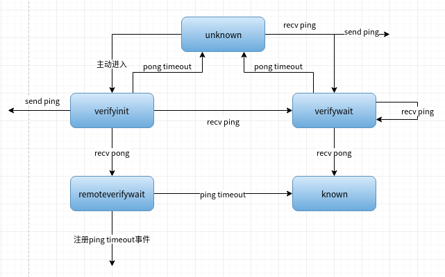
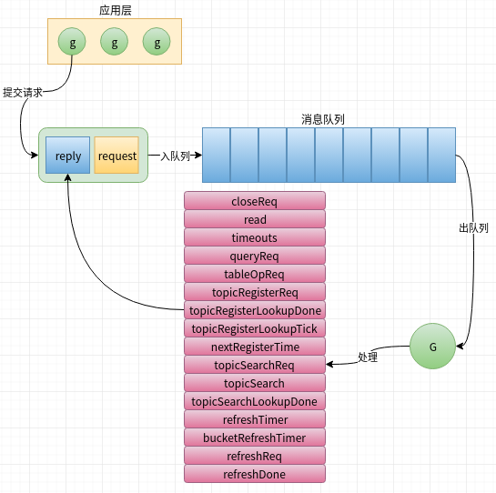

# 节点发现\(v5,已废弃\)

## 网络层

### 连接

Ethereum传输层采用UDP协议，每个UDP连接在实现时用一个`conn`接口抽象，golang包`net.UDPConn`是它的一个实现:



```go
type conn interface {
	ReadFromUDP(b []byte) (n int, addr *net.UDPAddr, err error)
	WriteToUDP(b []byte, addr *net.UDPAddr) (n int, err error)
	Close() error
	LocalAddr() net.Addr
}
```



`p2p.sharedUDPConn`也是它的实现，用来与v4版本的节点发现共用UDP连接，所有v4版本无法处理的包都会转给v5处理:



```go
func (srv *Server) setupDiscovery() error {
    //省略部分代码
    if !srv.NoDiscovery {
			if srv.DiscoveryV5 {
			    unhandled = make(chan discover.ReadPacket, 100)
			    sconn = &sharedUDPConn{conn, unhandled}
		   }
		   //省略代码
		}
    if srv.DiscoveryV5 {
		var ntab *discv5.Network
		var err error
		if sconn != nil {
			ntab, err = discv5.ListenUDP(srv.PrivateKey, sconn, "", srv.NetRestrict)
		} else {
			ntab, err = discv5.ListenUDP(srv.PrivateKey, conn, "", srv.NetRestrict)
		}
		if err != nil {
			return err
		}
		if err := ntab.SetFallbackNodes(srv.BootstrapNodesV5); err != nil {
			return err
		}
		srv.DiscV5 = ntab
	}
	return nil
}
```



### 协议

v5版本的节点发现的网络协议是两层结构，并且包大小超过1280字节，外层协议结构:

| 字段 | 大小\(字节\) | 描述 |
| :--- | :--- | :--- |
| 协议版本 | len\("temporary discovery v5"\) | 固定值: temporary discovery v5 |
| 签名 | 65 | 子协议类型和数据的签名 |
| 子协议类型 | 1 | 嵌套协议类型 |
| 子协议数据 | 可变 | 子协议数据 |

协议数据被接收被编码成`discv5.ingressPacket`结构:



```go
type ingressPacket struct {
	remoteID   NodeID   //远端节点ID
	remoteAddr *net.UDPAddr //远端节点udp地址
	ev         nodeEvent 
	hash       []byte  //
	data       interface{} // 内层嵌套协议
	rawData    []byte
}
```



对于不同请求，`ingressPacket.data`承载具体协议数据:



```go
//子协议类型
const (
  pingPacket = iota + 1
	pongPacket
	findnodePacket
	neighborsPacket
	findnodeHashPacket
	topicRegisterPacket
	topicQueryPacket
	topicNodesPacket
}
```



```go
//ping请求协议
ping struct {
		Version    uint
		From, To   rpcEndpoint
		Expiration uint64

		// v5
		Topics []Topic

		// Ignore additional fields (for forward compatibility).
		Rest []rlp.RawValue `rlp:"tail"`
}
```



```go
pong struct {
		To rpcEndpoint

		ReplyTok   []byte
		Expiration uint64

		// v5
		TopicHash    common.Hash
		TicketSerial uint32
		WaitPeriods  []uint32

		Rest []rlp.RawValue `rlp:"tail"`
	}
```



```go
findnode struct {
		Target     NodeID
		Expiration uint64
		
		Rest []rlp.RawValue `rlp:"tail"`
}
```



```go
findnodeHash struct {
		Target     common.Hash
		Expiration uint64
		
		Rest []rlp.RawValue `rlp:"tail"`
}
```



```go
neighbors struct {
		Nodes      []rpcNode
		Expiration uint64
		// Ignore additional fields (for forward compatibility).
		Rest []rlp.RawValue `rlp:"tail"`
}
```



```go
topicRegister struct {
		Topics []Topic
		Idx    uint
		Pong   []byte
}
```



```go
topicQuery struct {
		Topic      Topic
		Expiration uint64
}
```



```go
topicNodes struct {
		Echo  common.Hash
		Nodes []rpcNode
}
```



### 编解码

### 编解码

数据在发送到网络时需要进行编码:



```go
// zeroed padding space for encodePacket.
versionPrefix     = []byte("temporary discovery v5")
versionPrefixSize = len(versionPrefix)
sigSize           = 520 / 8  //65字节
headSize = versionPrefixSize + sigSize
var headSpace = make([]byte, headSize)

func encodePacket(priv *ecdsa.PrivateKey, ptype byte, req interface{}) (p, hash []byte, err error) {
	b := new(bytes.Buffer)
	b.Write(headSpace)  //协议头
	b.WriteByte(ptype)
	if err := rlp.Encode(b, req); err != nil {
		log.Error(fmt.Sprint("error encoding packet:", err))
		return nil, nil, err
	}
	packet := b.Bytes()
	sig, err := crypto.Sign(crypto.Keccak256(packet[headSize:]), priv)
	if err != nil {
		log.Error(fmt.Sprint("could not sign packet:", err))
		return nil, nil, err
	}
	copy(packet, versionPrefix)
	copy(packet[versionPrefixSize:], sig)
	hash = crypto.Keccak256(packet[versionPrefixSize:])
	return packet, hash, nil
}
```



从网络上接收数据需要进行解码并转化成目标数据结构:



```go
func decodePacket(buffer []byte, pkt *ingressPacket) error {
	if len(buffer) < headSize+1 {
		return errPacketTooSmall
	}
	buf := make([]byte, len(buffer))
	copy(buf, buffer)
	prefix, sig, sigdata := buf[:versionPrefixSize], buf[versionPrefixSize:headSize], buf[headSize:]
	if !bytes.Equal(prefix, versionPrefix) {
		return errBadPrefix
	}
	fromID, err := recoverNodeID(crypto.Keccak256(buf[headSize:]), sig)
	if err != nil {
		return err
	}
	pkt.rawData = buf
	pkt.hash = crypto.Keccak256(buf[versionPrefixSize:])
	pkt.remoteID = fromID
	switch pkt.ev = nodeEvent(sigdata[0]); pkt.ev {
	case pingPacket:
		pkt.data = new(ping)
	case pongPacket:
		pkt.data = new(pong)
	case findnodePacket:
		pkt.data = new(findnode)
	case neighborsPacket:
		pkt.data = new(neighbors)
	case findnodeHashPacket:
		pkt.data = new(findnodeHash)
	case topicRegisterPacket:
		pkt.data = new(topicRegister)
	case topicQueryPacket:
		pkt.data = new(topicQuery)
	case topicNodesPacket:
		pkt.data = new(topicNodes)
	default:
		return fmt.Errorf("unknown packet type: %d", sigdata[0])
	}
	s := rlp.NewStream(bytes.NewReader(sigdata[1:]), 0)
	err = s.Decode(pkt.data)
	return err
}
```



### 传输层

UDP连接创建完成后需要从连接上接收和发送数据包，ethereum抽象`udp`结构体完成这一工作:



```go
type udp struct {
	conn        conn
	priv        *ecdsa.PrivateKey
	ourEndpoint rpcEndpoint
	nat         nat.Interface
	net         *Network
}
func (t *udp) Close() //关闭连接
//向远端发送数据
func (t *udp) send(remote *Node, ptype nodeEvent, data interface{}) (hash []byte)
//向远端发送ping包
func (t *udp) sendPing(remote *Node, toaddr *net.UDPAddr, topics []Topic) (hash []byte)
//向远端发送查询ID请求
func (t *udp) sendFindnode(remote *Node, target NodeID)
func (t *udp) sendNeighbours(remote *Node, results []*Node)
func (t *udp) sendFindnodeHash(remote *Node, target common.Hash)
func (t *udp) sendTopicRegister(remote *Node, topics []Topic, idx int, pong []byte)
func (t *udp) sendTopicNodes(remote *Node, queryHash common.Hash, nodes []*Node)
func (t *udp) sendPacket(toid NodeID, toaddr *net.UDPAddr, ptype byte, req interface{}) (hash []byte, err error)
func (t *udp) readLoop()
func (t *udp) handlePacket(from *net.UDPAddr, buf []byte) error
```



### 处理数据

创建UDP连接完成后会启动一个goroutine从网络上接收数据包:



```go
func ListenUDP(priv *ecdsa.PrivateKey, conn conn, nodeDBPath string, netrestrict *netutil.Netlist) (*Network, error) {
	//省略代码
	go transport.readLoop()
	return net, nil
}
//读取网络数据循环
func (t *udp) readLoop() {
	defer t.conn.Close()

	buf := make([]byte, 1280)  //包最大是1280
	for {
		nbytes, from, err := t.conn.ReadFromUDP(buf)
		if netutil.IsTemporaryError(err) {
			//临时错误忽略
			continue
		} else if err != nil {
			//网络连接问题，退出
			log.Debug(fmt.Sprintf("Read error: %v", err))
			return
		}
		t.handlePacket(from, buf[:nbytes]) //处理数据包
	}
}
//处理udp数据包
func (t *udp) handlePacket(from *net.UDPAddr, buf []byte) error {
	pkt := ingressPacket{remoteAddr: from}
	if err := decodePacket(buf, &pkt); err != nil {
		return err
	}
	t.net.reqReadPacket(pkt)  //将数据包委托给上层处理
	return nil
}
```



## 节点状态

### 节点表示

discv5用结构体`Node`表示一个网络中的节点:


```go
type Node struct {
	IP       net.IP // 目标节点的ipv4/ipv6地址
	UDP, TCP uint16 // 目标节点UDP/TCP端口
	ID       NodeID // 节点ID

	nodeNetGuts
}
// nodeNetGuts is embedded in Node and contains fields.
type nodeNetGuts struct {
	sha common.Hash  //节点ID sha3缓存

	state             *nodeState  //记录的节点当前的状态
	pingEcho          []byte           // 最后一个发出的ping包hash
	pingTopics        []Topic          // 最后一个发出ping包中的topic集合
	deferredQueries   []*findnodeQuery // 暂未发出的findnodeQuery请求
	pendingNeighbours *findnodeQuery   // 当前正在等待响应的findnodeQuery请求
	queryTimeouts     int   //查询超时次数
}
```


### 节点ID

discv5网络中的节点都有一个唯一的ID标识，用类型`NodeID`表示:


```go
const nodeIDBits = 512
// NodeID is a unique identifier for each node.
// The node identifier is a marshaled elliptic curve public key.
type NodeID [nodeIDBits / 8]byte
```


节点的ID通过节点公钥计算得出:


```go
// PubkeyID returns a marshaled representation of the given public key.
func PubkeyID(pub *ecdsa.PublicKey) NodeID {
	var id NodeID
	pbytes := elliptic.Marshal(pub.Curve, pub.X, pub.Y)
	if len(pbytes)-1 != len(id) {
		panic(fmt.Errorf("need %d bit pubkey, got %d bits", (len(id)+1)*8, len(pbytes)))
	}
	copy(id[:], pbytes[1:])
	return id
}
```


### 状态机

当发现一个新节点，discv5基于状态机与新节点建立通信:



## 服务层

### 数据存储

服务层会持久化记录一些节点的信息

| 键 | 值 | 描述 |
| :--- | :--- | :--- |
| n:${NodeID}:discover:lastpong | uint64 | NodeID最后一次回复pong的时间 |
| n:${NodeID}:discover:lastping | uint64 | 对NodeID最后一次ping的时间 |
| n:${NodeID}:discover:findfail | uint64 | findnode查询目标NodeID时的错误次数 |

### `Network`类型

discv5利用结构体`discv5.Network`对上层提供节点发现服务:


```go
type Network struct {
	db          *nodeDB // 已知节点数据库
	conn        transport  //发送、接收数据包的网络连接层
	netrestrict *netutil.Netlist  //白名单

	closed           chan struct{}          // 是否关闭标志
	closeReq         chan struct{}          // 处理关闭请求channel
	refreshReq       chan []*Node           // 刷新请求channel
	refreshResp      chan (<-chan struct{}) // 刷新响应channel
	read             chan ingressPacket     // 接收的网络数据包channel
	timeout          chan timeoutEvent      //超时事件channel
	queryReq         chan *findnodeQuery    //查询node请求channel
	tableOpReq       chan func()						//操作dht的操作请求channel
	tableOpResp      chan struct{}					//操作dht的操作响应channel
	topicRegisterReq chan topicRegisterReq  //注册topic请求channel
	topicSearchReq   chan topicSearchReq    //搜索topic请求channel

	// State of the main loop.
	tab           *Table      //dht
	topictab      *topicTable //topic
	ticketStore   *ticketStore  //ticket
	nursery       []*Node				//初始节点列表
	nodes         map[NodeID]*Node // 活跃节点表
	timeoutTimers map[timeoutEvent]*time.Timer  //超时事件注册表

	// Revalidation queues.
	// Nodes put on these queues will be pinged eventually.
	slowRevalidateQueue []*Node
	fastRevalidateQueue []*Node

	// Buffers for state transition.
	sendBuf []*ingressPacket
}
```


### 消息队列



Network实例采用消息队列+单goroutine处理相关的事件、网络请求、操作。消息队列中包含的消息包括:

* 节点查询请求
* Topic注册、查询、搜索
* 刷新请求/响应和触发刷新的计时器
* DHT表操作
* 网络请求包
* 超时事件
* 关闭请求

Network实例在创建完成后会启动处理消息队列请求的goroutine:

```go
func newNetwork(conn transport, ourPubkey ecdsa.PublicKey, dbPath string, netrestrict *netutil.Netlist) (*Network, error) {
	ourID := PubkeyID(&ourPubkey)
	//省略代码
	go net.loop()  //启动消息队列
	return net, nil
}
```

### 刷新DHT

触发DHT刷新时间

* 启动时使用Bootstrap节点刷新
* 每隔1小时定时刷新
* 每隔1分钟刷新bucket

